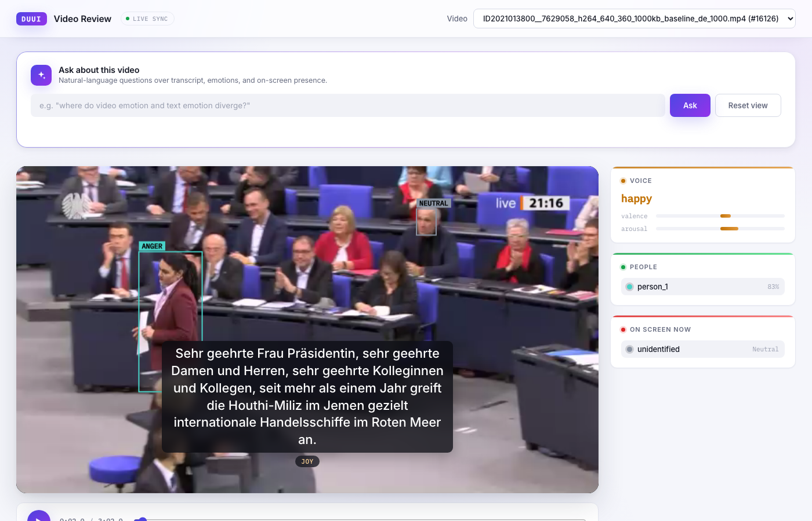
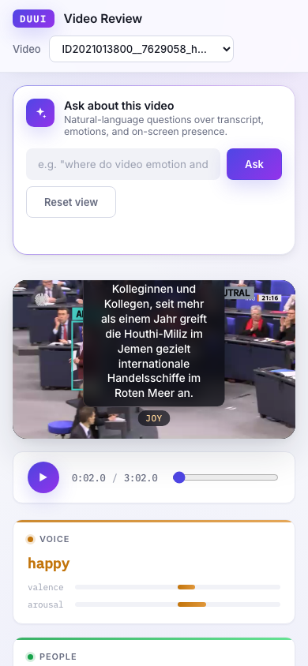
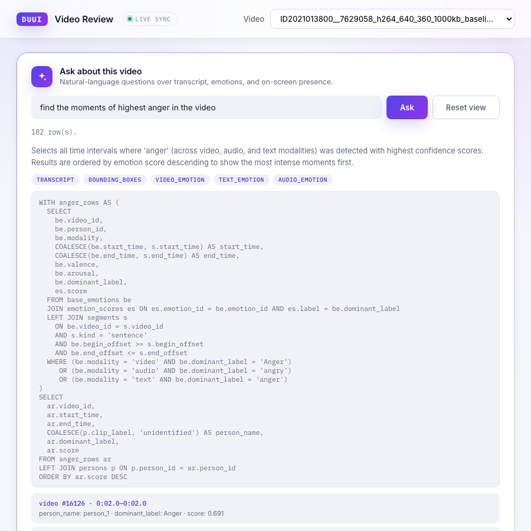

# DUUI Bundestag Video-Emotion CAS Parser

Parses UIMA CAS XMI output from the DUUI video-emotion pipeline into a
Postgres database.

## Project layout

```
.
├── main.py                # CLI entry point
├── Dockerfile             # one-off CAS importer image (docker compose run importer)
├── docker-compose.yml     # db + webapp + importer services
├── duui_parser/           # the parser package
├── webapp/                # video review viewer (subtitles, emotions, bounding boxes)
├── schema/                # database schema (schema.sql + docs)
├── typesystems/           # UIMA typesystem XML files (see below)
└── cas/                   # input .xmi files to parse, and the actual video files
```

## 1. Install dependencies

```bash
python -m venv .venv
source .venv/bin/activate        # Windows: .venv\Scripts\activate
pip install -r requirements.txt
```

## 2. Set up PostgreSQL

You need a Postgres server with the **pgvector** extension available
(the schema stores face/voice embeddings as native `vector` columns).

**Install Postgres + pgvector:**
- macOS (Homebrew): `brew install postgresql@16 pgvector`
- Ubuntu/Debian: `sudo apt install postgresql postgresql-16-pgvector` (package name varies by Postgres version -- see https://github.com/pgvector/pgvector#installation)
- Docker (simplest if you don't want a local install): `docker run -d --name duui-postgres -e POSTGRES_PASSWORD=yourpassword -p 5432:5432 pgvector/pgvector:pg16`

**Create the database and load the schema:**
```bash
createdb duui_bundestag
psql -d duui_bundestag -f schema/schema.sql
```
`schema/schema.sql` runs `CREATE EXTENSION IF NOT EXISTS vector;` itself, so as long as pgvector is installed on the server, no separate extension setup step is needed.

Verify it worked:
```bash
psql -d duui_bundestag -c "\dt"
```
You should see 15 tables (`videos`, `models`, `persons`, ... down to `emotion_fusion_references`).

## 3. Get the typesystem files

`typesystems/` must contain the three type-system descriptor XML files
that the Java DUUI pipeline used to produce your CAS:

- `IdentityEmotionTypeSystem.xml`
- `MultimodalIdentityTypeSystem.xml`
- `EmotionTypeSystem.xml`

These come from the pipeline project itself, not from this repo --
usually under something like `src/main/resources/` or `desc/type/` in
the Java project. Note: these three files turned out to overlap
heavily (see `duui_parser/typesystem.py`'s docstring) and reference a
handful of types (`MultimediaElement`, `AudioToken`, `MetaData`,
`Embedding`) that live in external shared typesystem imports not
included in any of the three -- the parser handles both cases
automatically (de-duplication + fallback type definitions), so you
don't need to track down the missing imports yourself.

Drop the three files into `typesystems/`.

## 4. Add your CAS file

Put the `.xmi` file you want to parse into `cas/`.

## 5. Configure

```bash
cp .env.example .env
```

Edit `.env` with your real database credentials and confirm the file
paths match what you placed in steps 3-4. Everything in `.env` maps
directly to `duui_parser/config.py`, so if you'd rather not use a
`.env` file, exporting the same variables in your shell/CI works
identically.

## 6. Run

```bash
python main.py                    # uses DUUI_XMI_FILE from .env
python main.py cas/other_file.xmi # or pass a path explicitly
```

This loads and patches the typesystem, loads the CAS (lenient mode --
annotation types outside this parser's scope, e.g. linguistic
Token/POS/Dependency layers, are safely skipped), runs every parser
step in `duui_parser/parsers/PARSE_STEPS`, and commits the result in a
single transaction (rolled back automatically if any step raises).

## Processing multiple CAS files

For a batch of files, loop over `run()` rather than calling `main.py`
repeatedly -- this avoids reloading and re-patching the typesystem for
every file:

```python
from pathlib import Path
from duui_parser.pipeline import run

for xmi_path in Path("cas").glob("*.xmi"):
    run(str(xmi_path))
```

If this grows into a real batch job, it's worth having `run()` accept
an already-loaded typesystem instead of reloading it every call --
happy to add that if you get there.

## Web viewer

`webapp/` is a small video review tool: pick an imported video, play
it, and see subtitles, per-modality emotions, and face/person
bounding boxes rendered in sync with playback -- all read live from
Postgres, nothing pre-rendered into the video file itself.

**Screenshots** (desktop and mobile, real Bundestag sample data, no
mockups):

<p align="center">
  <br>
  <sub>Playback in progress -- a face bounding box tagged <code>ANGER</code>, the current subtitle, a <code>JOY</code> text-emotion badge, and the sidebar's live voice/people/on-screen readouts, all resolved for this exact video timestamp.</sub>
</p>

<p align="center">
  
  &nbsp;&nbsp;
  
  <br>
  <sub>Left: the same view responsive on mobile. Right: a natural-language query's results -- SQL, explanation, overlay tags, and a scrollable list of clickable "jump to this clip" segments (see below).</sub>
</p>

**Using it** (once the stack is running, see Setup below):

Open http://localhost:8010 (or wherever you're serving it):

1. **Pick a video** -- the top-right dropdown lists every video that's
   been imported (`videos.filename`). Selecting one loads its data and
   starts the player.
2. **Watch it play** -- standard controls (play/pause, scrubber, time
   readout) at the bottom of the frame. Everything else on the page
   updates live as the video plays, synced to `currentTime`:
   - *Subtitles* burn in at the bottom of the frame, sentence by
     sentence.
   - *A text-emotion badge* appears next to the subtitle (e.g. `JOY`)
     -- the dominant emotion detected from the words themselves.
   - *Bounding boxes* are drawn over detected faces/people, each
     labeled with that box's video-modality emotion (e.g. `ANGER`) if
     available.
   - *Voice panel* (sidebar) shows the current audio-modality emotion
     plus valence/arousal bars -- emotion from tone of voice,
     independent of what's being said.
   - *Fused emotion panel* appears only if the pipeline computed a
     combined score, hidden otherwise.
   - *People panel* lists everyone identified in the video with a
     confidence score; *On screen now* shows who's actually visible at
     this exact instant, color-matched to their bounding box.
3. **Ask a question** -- the box at the top skips manual scrubbing
   entirely. Type something like *"find the moments of highest anger"*
   or *"where do video and text emotion disagree?"* and hit **Ask**.
   A few things worth knowing:
   - It genuinely takes time -- anywhere from a few seconds to several
     minutes, since it's an agent iterating on real SQL against a
     shared, slow model, not a canned lookup (see "Natural-language
     query agent" below). There's no progress bar yet, so don't
     resubmit while it says "Thinking...".
   - Results come back as a clickable list -- click any row and the
     player jumps straight to that clip, automatically switching the
     sidebar/overlays to show *only* what's relevant to your question
     (e.g. asking about anger hides panels that question didn't ask
     about).
   - **"Reset view"** clears the query and goes back to showing
     everything, for normal browsing.

That's the whole loop: browse normally by picking a video and
scrubbing, or let the query agent jump you straight to the moments you
actually care about.

**Setup:**

1. Put the actual video file(s) in the directory named by
   `DUUI_VIDEO_DIR` in `.env` (defaults to `cas/`), with the filename
   matching each row's `videos.filename` column exactly (e.g. if the
   DB says `filename = 'first2.mp4'`, the file must be at
   `cas/first2.mp4`). The database only stores metadata, never the
   video bytes.
2. Run the parser first (`python main.py`) so there's data to show.
3. Start the viewer from the project root:
   ```bash
   uvicorn webapp.server:app --reload
   ```
4. Open http://127.0.0.1:8000 -- pick a video from the dropdown in the
   top bar.

**How the syncing works** (`webapp/server.py` + `webapp/static/app.js`):
- *Subtitles*: sentence-level `segments` rows don't store their own
  text, so the backend reconstructs each sentence's caption by joining
  every `linguistic_tokens.word` whose `start_time` falls inside that
  sentence's `[start_time, end_time]` window (matched by time overlap,
  not `linguistic_tokens.segment_id` -- confirmed against real data
  that FK isn't always populated by the source annotator).
- *Bounding boxes*: `face_detections`/`person_detections` are sampled
  per-frame, so the frontend finds whichever detection is nearest to
  the current playback time (within a 150 ms tolerance) and draws it
  scaled to the video's displayed size (`x/y/w/h` are normalized
  0..1, so this works regardless of the video's native resolution).
- *Video-modality emotion labels on boxes*: `base_emotions` rows don't
  carry their own bounding box -- they share `frame_index` with the
  detection they were computed from, which is the join used to attach
  a label (e.g. "SURPRISE") to the right box.
- *Voice panel*: whichever `audio`-modality `base_emotions` row covers
  the current time drives the label + valence/arousal bars.
- *Text-emotion badge*: same idea for `text`-modality rows, shown next
  to the subtitle.

**Multiple people / longer videos**: the current version loads the
full per-video payload in one request, which is fine for short clips
but would get large for an hour-long session with dense per-frame
detections. If you outgrow that, the natural next step is adding
`?start=&end=` windowing to `/api/videos/{id}/data` and having the
frontend fetch a rolling window around the current playback time
instead of everything up front -- happy to add that when you have a
longer real file to test it against.

## Importing a CAS file (Docker)

If you're running the stack via `docker compose` (see `docker-compose.yml`)
rather than a local venv, importing a new CAS doesn't need Python/
`dkpro-cassis` installed on the host at all -- there's a dedicated
`importer` service for it, built from the root `Dockerfile`.

It's deliberately **not** part of the webapp container: `webapp/Dockerfile`
only installs `webapp/requirements.txt` (FastAPI, psycopg2, openai --
no `dkpro-cassis`/lxml) to keep that image small, since `webapp/server.py`
never parses CAS files itself, only reads what's already in Postgres.
The importer is a separate one-off job, not a long-running service, so
it's excluded from `docker compose up` by the `import` profile and only
runs when invoked explicitly.

**What to mount** (already wired up in `docker-compose.yml`):
- `./cas:/app/cas` -- both the `.xmi` file you're importing and the
  matching video file live here; same directory the `webapp` service
  mounts read-only as `/videos` (see step 4 below for why the names
  have to match).
- `./typesystems:/app/typesystems:ro` -- the three typesystem XML
  files from step 3 above.

**Env vars the importer container needs** (already set by
`docker-compose.yml`'s `importer.environment` block -- only relevant
if you're running the built image directly instead of through compose):
- `DUUI_DB_HOST=db` -- the Postgres service's name on the compose
  network, **not** `localhost` (that only works when running `main.py`
  on the host against the container's exposed port 5432).
- `DUUI_DB_NAME`, `DUUI_DB_USER`, `DUUI_DB_PASSWORD` -- must match the
  `db` service's `POSTGRES_*` values (`duui_bundestag`/`duui`/`duui`).
- `DUUI_TS_IDENTITY_EMOTION`, `DUUI_TS_MULTIMODAL_IDENTITY`,
  `DUUI_TS_EMOTION` -- only needed if your typesystem filenames differ
  from the defaults in `duui_parser/config.py` (`typesystems/*.xml`).

**Entrypoint**: the image's `ENTRYPOINT` is `python main.py`, so you
only ever pass the CAS path as the command:

```bash
docker compose up -d db                         # wait for it to become healthy
docker compose run --rm importer cas/your_file.xmi
docker compose up -d webapp
```

Re-running against a file you already imported is safe -- see the
`UNIQUE (emotion_id, label)` / `ON CONFLICT ... DO NOTHING` note at the
bottom of this README.

**Filename matching still applies**: whatever file the CAS references
as its source video needs to exist in `cas/` under that exact name --
same requirement as the non-Docker path in "Web viewer" above, since
`videos.filename` is what both the importer and the webapp key off of.

## Natural-language query agent

The "Ask" bar above the player lets you type a question like *"give me
the video sequences where video emotion and text emotion diverge"*
instead of writing SQL by hand, and get back a clickable list of the
exact clips that answer it. This is a genuine agent, not a canned
query template: it explores the schema, writes real SQL, checks its
own work, and decides which parts of the UI are relevant to show --
all driven by `duui_parser/query_agent/`.

### How a question actually gets answered

```
 "find the moments of highest anger"
              │
              ▼
   ┌───────────────────────────────────────────────────────────┐
   │  agent.py -- tool-use loop, up to 6 iterations              │
   │  (openai SDK, OpenAI-compatible chat-completions endpoint)   │
   └───────────────────────────────────────────────────────────┘
              │                              ▲
              │ 1. model calls run_sql(...)   │ 4. preview: columns,
              ▼                                │    up to 20 rows,
      ┌──────────────────┐                     │    row count, or an
      │  sql_guard.py     │────────────────────┘    error message
      │  validate + run   │  2. reject non-SELECT / DML / multi-statement
      │  read-only,       │  3. execute inside READ ONLY transaction,
      │  row-capped       │     statement_timeout, LIMIT wrapper
      └──────────────────┘
              │
              │ 5. model repeats 1-4 to fix a bad query, then calls
              │    submit_answer(sql, explanation, overlays) once
              ▼
   agent.py re-runs *that exact SQL* itself via sql_guard.py again --
   never trusting rows the model merely claims to have seen -- and
   returns {sql, explanation, overlays, columns, rows, row_count}
```

The three files, each with one job:

1. **`schema_context.py`** is the system prompt: not just `information_schema`
   (which can't tell you that `duration`/`fps` are almost always NULL, that
   `global_persons` is essentially unused in practice, or that comparing
   emotions across modalities means joining through the `segments` row
   whose time window they fall inside). It's cross-checked against three
   sources -- the intended schema doc, what the parser's INSERT statements
   actually write, and a live query against a populated database for real
   label vocabularies -- and includes one fully worked example query for
   cross-modal "divergence" questions, since that pattern is the hardest
   one to get right from column names alone.
2. **`agent.py`** owns the loop and the two tools the model can call:
   `run_sql` (a sandboxed preview -- 20 rows, total count, or an error to
   learn from) to explore and validate candidate queries, and
   `submit_answer` (final SQL + a plain-language explanation + which
   **overlays** the frontend should show) to finish. If the model responds
   with plain text instead of calling a tool, it gets nudged back on track
   rather than the request failing outright. Any API-level failure (bad
   key, rate limit, model timeout) is caught and surfaced as a clean `422`
   with a real message, not a raw `500`.
3. **`sql_guard.py`** is what actually keeps this safe to run against a
   real database, in two independent layers -- because neither alone
   would be trustworthy against a model that might emit something
   unexpected: a syntactic check rejecting anything that isn't a single
   `SELECT`/`WITH ... SELECT` statement (multi-statement input and any
   DML/DDL keyword -- `INSERT`, `DROP`, `GRANT`, `COPY`, ... -- are blocked
   before the query ever reaches Postgres), *and* Postgres's own
   `SET TRANSACTION READ ONLY`, enforced by the engine regardless of what
   slipped past the first check. On top of that, every query runs with a
   statement timeout (`DUUI_QUERY_STATEMENT_TIMEOUT_MS`, default 8000ms --
   catches e.g. a missing join condition blowing up into a huge cross
   product) and a hard row cap (`DUUI_QUERY_MAX_ROWS`, default 500, applied
   by wrapping the query in `SELECT * FROM (<query>) AS _sub LIMIT n`).

`POST /api/ask {"question": "..."}` (see `webapp/server.py`) returns
the SQL, explanation, overlays, and result rows; rows exposing
`video_id`/`start_time`/`end_time` are turned into clickable "jump to
this clip" segments. Clicking one seeks the player to that moment and
switches the frontend into showing *only* the overlays the agent
picked -- e.g. a divergence question shows the transcript plus the
video- and text-emotion labels, and hides the voice panel and fused
readout, since those weren't asked about. "Reset view" clears this and
goes back to showing everything.

Requires `DUUI_QUERY_API_KEY` in `.env`. `DUUI_QUERY_BASE_URL` and
`DUUI_QUERY_MODEL` default to the university Qwen3-VL gateway this
project was built against -- point them at a different OpenAI-compatible
provider/model if needed. Note this particular model is slow: a single
question can take anywhere from a few seconds to several minutes,
depending on how many `run_sql` iterations it needs (multi-step tool use
against a large model, no progress indicator in the UI yet) -- that's
expected, not a hang.

### Use cases (all validated against the real Bundestag sample data)

These are questions we actually ran through the agent end-to-end, not
hypothetical examples -- included to show the range of what "explore
the schema and write real SQL" covers in practice:

- **Cross-modal divergence** -- *"where do video emotion and text
  emotion diverge?"* The motivating use case, and the one worked
  example baked into the system prompt: join `base_emotions` rows from
  the `video` and `text` modalities through the `segments` row whose
  time window contains both, and surface sentences where the two
  disagree. Overlays picked: `transcript`, `video_emotion`,
  `text_emotion`, `bounding_boxes` (not `audio_emotion` or
  `fused_emotion`, since the question never asked about those).
- **Emotional highlights** -- *"find the moments of highest anger in
  the video"*. The agent independently discovered it needed to check
  all three modalities' differing label vocabularies for the same
  emotion (`'Anger'` for video, `'angry'` for audio, `'anger'` for
  text) rather than assuming one shared spelling, unioned them, joined
  to `persons` for display names, and sorted by confidence score --
  entirely without being told the vocabularies differ (that's
  documented in `schema_context.py`, not hardcoded into the query).
- **Speaker-focused** -- *"when is person_1 speaking, and what's their
  tone?"* A `segments` (`kind = 'sentence'`) join to `persons` filtered
  on `clip_label`, giving back every time window that speaker talks.
- **On-screen presence** -- *"who is visible on screen throughout the
  video?"* Reads `presences` (modality `'visible'`), left-joined to
  `persons` so intervals with no resolved identity correctly come back
  labeled `'unidentified'` rather than being silently dropped.
- **Confidence-based** -- *"how confident was the model in the
  Contempt reading at various points?"* Joins `base_emotions` to
  `emotion_scores` for a specific label and ranks by `score` -- useful
  for judging whether a labeled emotion is a strong or borderline read.
- **Intensity ranking** -- *"rank the most emotionally intense
  sentences by valence/arousal magnitude"*. Computes
  `sqrt(valence^2 + arousal^2)` per sentence from the audio-modality
  `base_emotions` row covering it, ranking "how strong," not just
  "which label."
- **Simple aggregates** -- *"how many sentences are in this video?"*
  resolves in a single `run_sql` call with no exploration needed --
  the loop only takes as many iterations as the question actually
  requires.
- **A deliberately malicious probe** -- `DELETE FROM videos WHERE
  video_id = 16126` run directly through `sql_guard.run_read_only`
  (bypassing the agent, to test the guard itself) was correctly
  rejected with `"Query must start with SELECT or WITH."` before ever
  reaching Postgres.

## Database schema

`schema/schema.sql` is the authoritative schema (also documented in
`schema/data_schema_with_types.md`); the parser's INSERT statements
are written to match it exactly: `videos`, `models`, `global_persons`,
`persons`, `segments`, `linguistic_tokens`, `face_embeddings`,
`voice_embeddings`, `presences`, `face_detections`,
`person_detections`, `base_emotions`, `emotion_scores`,
`fused_emotions`, `emotion_fusion_references`. The parser does not
create these tables -- run `schema/schema.sql` once before the first
import (see step 2 above).

One addition was made relative to the schema.sql you may have
originally: `emotion_scores` now has `UNIQUE (emotion_id, label)`,
since the parser relies on that for `ON CONFLICT (emotion_id, label)
DO NOTHING` to make re-running the pipeline on the same file
idempotent.
